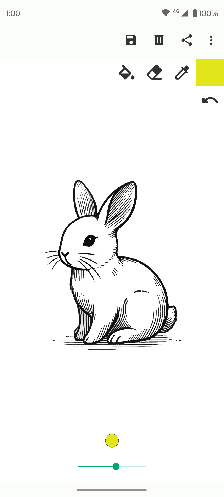
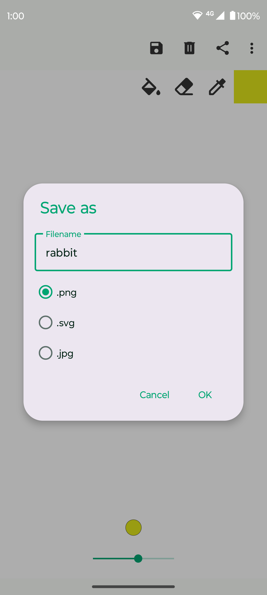
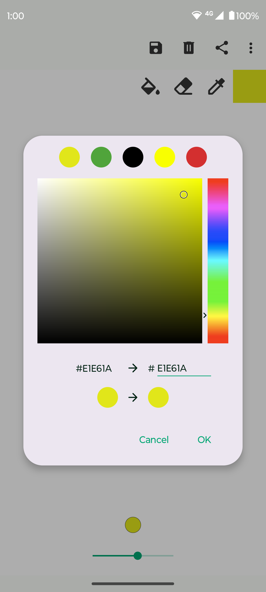

# Fossify Paint

Fossify Paint is your go-to app for effortless sketching and creative expression. Whether you want
to doodle something fun or craft detailed digital art, Fossify Paint is built to give you complete
control while respecting your privacy.

**✏️ QUICK & EASY SKETCHING:**  
Start drawing immediately—no complicated setup or advanced tools needed. Just choose your brush
size, pick your color, and bring your ideas to life on a clean digital canvas.

**🎨 FULLY CUSTOMIZABLE ART SPACE:**  
Customize every aspect of your drawing experience. Change the canvas background, adjust brush size,
and fine-tune colors with precision using hex codes.

**🖼️ VERSATILE FILE FORMATS:**  
Fossify Paint supports popular formats like PNG, JPG, and SVG. Whether you’re saving a simple sketch
or sharing detailed artwork, you can easily export your creations in the format that suits your
needs.

**🛡️ PRIVACY & SECURITY BUILT-IN:**  
As with all Fossify apps, Fossify Paint works completely offline with no intrusive permissions. Your
artwork stays secure on your device, ensuring peace of mind.

**🌐 OPEN-SOURCE COMMITMENT:**  
Fossify Paint is open-source and transparent. Explore the code on GitHub, contribute to the project,
and be part of a community that values privacy and creativity.

Fossify Paint caters to artists of all ages and skill levels—create, customize, and share your
art, all while keeping your privacy intact.

➡️ Explore more Fossify apps: https://www.fossify.org 
➡️ Open-Source Code: https://www.github.com/FossifyOrg 
➡️ Join the community on Reddit: https://www.reddit.com/r/Fossify 
➡️ Connect on Telegram: https://t.me/Fossify

